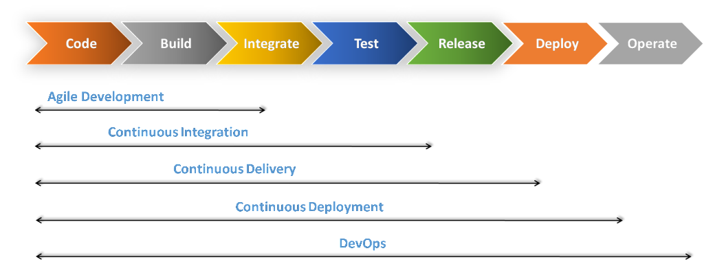
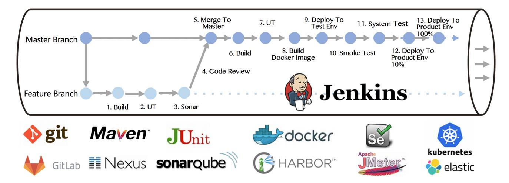
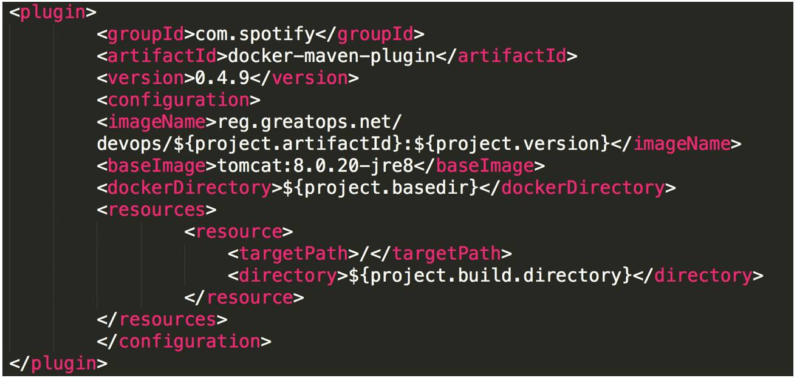
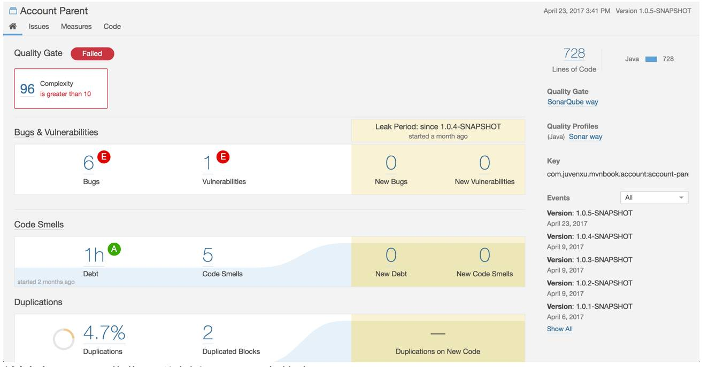
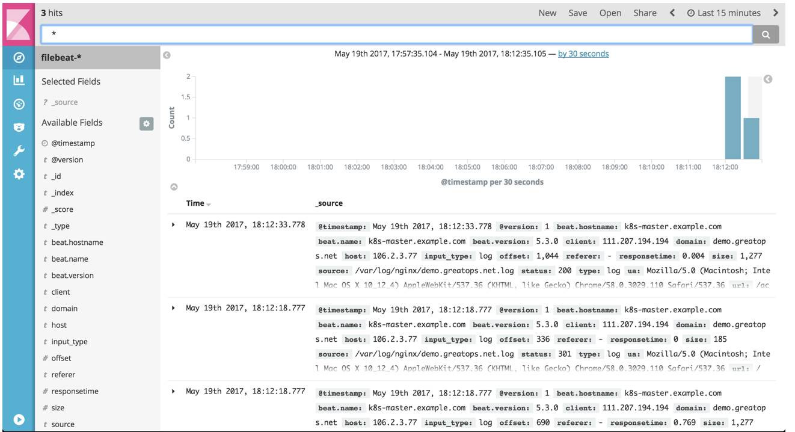

# Introduction

## DevOps 是什么

DevOps /de'vɒps/ 是近年来兴起的一个很流行的概念，一直以来业界对 DevOps 到底是什么没有一个统一的定论。 从字面上来看 Dev 指的 Development，Ops 指的是的 Operations，它提倡的是重视软件开发人员和运维人员的沟通合作，通过自动化流程来使得软件构建、测试、发布更加快捷、频繁和可靠。用一句话来说，就是打通开发运维的壁垒，实现开发运维一体化。

DevOps 是为了填补开发端和运维端之间的信息鸿沟，改善团队间的合作关系。但是 DevOps 的理念不止于此，DevOps 希望做到的是软件交付过程中整个 IT 工具链的打通，使得各个团队减少时间损耗，更加高效的协同合作。下图可以帮助我们更好的理解 DevOps 工作流，它在开发和运维之间形成了一个良好的闭环，可以大大增加产出的效率。

本质上来讲 DevOps 是一种文化和理念，得益于微服务架构理念和容器技术的发证，围绕这种理念这些年来经过许多公司的实践衍生出了一套工作流，更多时候我们是把 DevOps 当做是一种工作流来理解。现在对 DevOps 最常见的误解是把它当做是一种角色，比如有些人会把自己称为是 DevOps 工程师。

## **历史变革**

DevOps 运动在 2007 到 2008 年间开始盛行，实际上 DevOps 这个概念是由敏捷开发发展而来的。从敏捷开发到 DevOps 有如下阶段：

 **敏捷开发-&gt;持续集成-&gt;持续交付-&gt;持续部署-&gt;DevOps**

**持续集成（Continuous Integration）**指的是：代码集成到主干之前，必须全部通过自动化测试；只要有一个测试用例失败，就不能集成。持续集成的要实现的目标是：在保持高质量的基础上，让产品可以快速迭代。

**持续交付（Continuous Delivery）**指的是：开发人员频繁地将软件的新版本，交付给质量团队或者用户，以供评审。如果评审通过，代码就被发布。如果评审不通过，那么需要开发进行变更后再提交。

**持续部署（Continuous Deployment）**指的是：代码通过评审并发布后，自动部署，以交付使用。

**DevOps** 是一组完整的实践，可以自动化软件开发和 IT 团队之间的流程，以便他们可以更快、更可靠地构建、测试和发布软件。

## 工具链

上图是 Atlassian 公司总结出的工具链集合

 上图是 [CNCF](https://www.cncf.io/) Cloud Native Landscape 项目总结的云原生工具链

下面我们将上面两张图中的工具类型及对应的工具整理如下：

<table>
  <thead>
    <tr>
      <th style="text-align:left">&#x7C7B;&#x578B;</th>
      <th style="text-align:left">&#x5DE5;&#x5177;&#x96C6;</th>
    </tr>
  </thead>
  <tbody>
    <tr>
      <td style="text-align:left">&#x9879;&#x76EE;&#x7BA1;&#x7406;</td>
      <td style="text-align:left">
        
<a href="https://www.atlassian.com/software/jira">JIRA</a>&#x3001; <a href="https://asana.com">Asana</a>&#x3001;
          <a
          href="https://taiga.io">Taiga</a>&#x3001; <a href="https://trello.com">Trello</a>&#x3001; <a href="https://basecamp.com">Basecamp</a> &#x3001;
            <a
            href="http://www.redmine.org">redmine</a>&#x3001;

        
<a href="https://pivotal.io/">Pivotal Tracker</a>&#x3001; <a href="https://www.zentao.net/">&#x7985;&#x9053;</a>
        

      </td>
    </tr>
    <tr>
      <td style="text-align:left">&#x4EE3;&#x7801;&#x7BA1;&#x7406;</td>
      <td style="text-align:left"><a href="https://github.com">GitHub</a>&#x3001;<a href="https://about.gitlab.com">GitLab</a>&#x3001;
        <a
        href="https://bitbucket.org">BitBucket</a>&#x3001; <a href="http://subversion.apache.org">Subversion</a>
      </td>
    </tr>
    <tr>
      <td style="text-align:left">&#x4F9D;&#x8D56;&#x6784;&#x5EFA;</td>
      <td style="text-align:left"><a href="http://ant.apache.org">Ant</a>&#x3001;<a href="https://gradle.org/">Gradle</a>&#x3001;
        <a
        href="http://maven.apache.org/">Maven</a>&#x3001; <a href="https://www.npmjs.com/">npm</a>
      </td>
    </tr>
    <tr>
      <td style="text-align:left">&#x6301;&#x7EED;&#x96C6;&#x6210;</td>
      <td style="text-align:left">
        
<a href="https://www.atlassian.com/software/bamboo">Bamboo</a>&#x3001;
          <a
          href="http://hudson-ci.org/">Hudson</a>&#x3001;<a href="https://jenkins.io">Jenkins</a>&#x3001;<a href="https://capistranorb.com/">Capistrano</a>&#x3001;
            <a
            href="https://aws.amazon.com/cn/codedeploy/">CodeDeploy</a>&#x3001;

        
<a href="https://www.travis-ci.org/">Travis CI</a>&#x3001;<a href="https://circleci.com/">circleci</a>
        

      </td>
    </tr>
    <tr>
      <td style="text-align:left">&#x914D;&#x7F6E;&#x7BA1;&#x7406;</td>
      <td style="text-align:left"><a href="https://www.ansible.com/">Ansible</a>&#x3001;<a href="https://www.chef.io/">Chef</a>&#x3001;
        <a
        href="https://puppet.com/">Puppet</a>&#x3001;<a href="https://www.saltstack.com/">SaltStack</a>
      </td>
    </tr>
    <tr>
      <td style="text-align:left">&#x5BB9;&#x5668;&#x7F16;&#x6392;</td>
      <td style="text-align:left"><a href="www.docker.com/">Docker</a>&#x3001;<a href="https://linuxcontainers.org/">LXC</a>&#x3001;
        <a
        href="https://kubernetes.io/">Kubernetes</a>&#x3001;<a href="http://mesos.apache.org">Apache Mesos</a>&#x3001;
          <a
          href="https://mesosphere.com">DC/OS</a>
      </td>
    </tr>
    <tr>
      <td style="text-align:left">&#x811A;&#x672C;&#x8BED;&#x8A00;</td>
      <td style="text-align:left"><a href="https://www.python.org/">Python</a>&#x3001;<a href="www.ruby-lang.org">Ruby</a>&#x3001;Shell</td>
    </tr>
    <tr>
      <td style="text-align:left">&#x65E5;&#x5FD7;&#x5206;&#x6790;</td>
      <td style="text-align:left"><a href="https://www.elastic.co">Elasticsearch</a>&#x3001;<a href="https://www.elastic.co/cn/products/logstash">Logstash</a>&#x3001;
        <a
        href="https://www.fluentd.org/">Flutentd</a>&#x3001;<a href="https://www.elastic.co/cn/products/kibana">Kibana</a>&#x3001;
          <a
          href="https://logentries.com/">Logentries</a>
      </td>
    </tr>
    <tr>
      <td style="text-align:left">&#x5E94;&#x7528;&#x76D1;&#x63A7;</td>
      <td style="text-align:left">
        
<a href="https://prometheus.io">Prometheus</a>&#x3001;<a href="https://www.datadoghq.com">Datadog</a>&#x3001;
          <a
          href="https://graphite.readthedocs.io">Graphite</a>&#x3001;<a href="https://icinga.com/">Icinga</a>&#x3001;
            <a
            href="https://www.nagios.org">Nagios</a>&#x3001;

        
<a href="https://www.pingdom.com/">Pingdom</a>&#x3001;<a href="https://www.appdynamics.com/">AppDynamics</a>&#x3001;
          <a
          href="https://newrelic.com">New Relic</a>&#x3001;<a href="https://www.splunk.com/">Splunk</a>&#x3001;
            <a
            href="https://www.zabbix.com/">Zabbix</a>&#x3001;

        
<a href="https://www.pagerduty.com/">PagerDuty</a>
        

      </td>
    </tr>
    <tr>
      <td style="text-align:left">&#x538B;&#x529B;&#x6D4B;&#x8BD5;</td>
      <td style="text-align:left"><a href="https://jmeter.apache.org">JMeter</a>&#x3001;<a href="https://www.blazemeter.com/">Blaze Meter</a>&#x3001;
        <a
        href="https://loader.io/">loader.io</a>
      </td>
    </tr>
    <tr>
      <td style="text-align:left">&#x5355;&#x5143;&#x6D4B;&#x8BD5;</td>
      <td style="text-align:left"><a href="https://junit.org/">JUnit</a>&#x3001;<a href="https://nunit.org/">NUnit</a>&#x3001;
        <a
        href="https://www.seleniumhq.org/">Selenium</a>&#x3001;<a href="https://sourceforge.net/projects/cppunit/">CppUnit</a>&#x3001;
          <a
          href="https://testng.org/">TestNg</a>&#x3001;<a href="https://xunit.net/">XUnit</a>
      </td>
    </tr>
    <tr>
      <td style="text-align:left">&#x4EE3;&#x7801;&#x8986;&#x76D6;&#x7387;</td>
      <td style="text-align:left">
        
<a href="https://www.sonarqube.org/">SonarQube</a>&#x3001;<a href="http://www.ncover.com/">NCover</a>&#x3001;
          <a
          href="https://www.atlassian.com/software/clover">Clover</a>&#x3001;<a href="https://sourceforge.net/projects/cobertura/">Cobertura</a>&#x3001;
            <a
            href="http://sourceforge.net/projects/emma/files/emma-testing/">Emma</a>&#x3001;

        
<a href="http://www.thucydides.info/#/">Serenity</a>&#x3001;<a href="https://www.eclemma.org/jacoco/trunk/doc/index.html">Jacoco</a>
        

      </td>
    </tr>
    <tr>
      <td style="text-align:left">&#x4EE3;&#x7801;&#x5206;&#x6790;</td>
      <td style="text-align:left"><a href="http://checkstyle.sourceforge.net/">Checkstyle</a>&#x3001;
        <a
        href="https://pmd.github.io/">PMD</a>&#x3001;<a href="http://findbugs.sourceforge.net/">Findbugs</a>
      </td>
    </tr>
    <tr>
      <td style="text-align:left">&#x5B89;&#x5168;&#x5DE5;&#x5177;</td>
      <td style="text-align:left"><a href="http://www.openldap.org/">OpenLDAP</a>&#x3001;<a href="https://www.atlassian.com/software/crowd">Crowd</a>&#x3001;
        <a
        href="https://openid.net/">OpenID</a>
      </td>
    </tr>
    <tr>
      <td style="text-align:left">&#x5E94;&#x7528;&#x670D;&#x52A1;&#x5668;</td>
      <td style="text-align:left"><a href="https://www.oracle.com/middleware/technologies/weblogic.html">Weblogic</a>&#x3001;
        <a
        href="https://javaee.github.io/glassfish/">Glassfish</a>&#x3001;<a href="http://tomcat.apache.org/">Tomcat</a>&#x3001;
          <a
          href="https://www.jboss.org/">JBoss</a>&#x3001;<a href="https://www.iis.net/">IIS</a>&#x3001;<a href="https://jrebel.com/">JRebel</a>
      </td>
    </tr>
    <tr>
      <td style="text-align:left">Web&#x670D;&#x52A1;&#x5668;</td>
      <td style="text-align:left"><a href="http://httpd.apache.org/">Apache</a>&#x3001;<a href="http://nginx.org/">Nginx</a>&#x3001;
        <a
        href="http://tengine.taobao.org/">Tengine</a>
      </td>
    </tr>
    <tr>
      <td style="text-align:left">&#x865A;&#x62DF;&#x673A;&#x73AF;&#x5883;</td>
      <td style="text-align:left"><a href="https://www.amazonaws.cn/en/ec2/">EC2</a>&#x3001;<a href="https://www.virtualbox.org/">Virtual Box</a>&#x3001;
        <a
        href="https://www.vmware.com/">VmWare</a>
      </td>
    </tr>
    <tr>
      <td style="text-align:left">&#x670D;&#x52A1;&#x6CE8;&#x518C;&#x4E0E;&#x53D1;&#x73B0;</td>
      <td style="text-align:left"><a href="https://zookeeper.apache.org/">Zookeeper</a>&#x3001;<a href="https://etcd.io/">etcd</a>&#x3001;
        <a
        href="https://www.consul.io/">Consul</a>
      </td>
    </tr>
  </tbody>
</table>在工具的选择上，需要结合公司业务需求和技术团队情况而定。

## 端到端部署流水线

前面我们总结的工具链涵盖了从项目管理到开发再到部署的一整套流程，下面我们关注打造一个全开源的部署流水线。

示例中的工具全是开源工具，涵盖依赖与镜像管理、代码管理、持续集成、代码质量、自动化测试、容器化编排和日志管理等。

我们可以将整个流水线分为三个阶段

* 提交阶段：代码提交 Merge Requst 前进行编译、单元测试的验证，防止破坏主线
* 验证阶段：基于主线的集成和多环境的自动化测试验证，输出可部署的高质量的版本包
* 部署阶段：基于已发布的版本包部署到生产环境

 **关键点1**：基于Jenkins与Gitlab集成，实现提交验证。需要使用 Gitlab API、Jenkins Gitlab 插件、Job深度配置实现完美集成

 **关键点2**：Maven 与 Docker 集成实现镜像自动制作，我们选用 Spotify 的 docker-maven 插件与 Dockerfile 集成实现镜像的自动制作和版本关联。

 **关键点3**：SonarQube 质量门设置和代码质量分析

 **关键点4**：ELK 收集、分析和展示日志信息

## 参考资料

[http://greatops.net/?id=165](http://greatops.net/?id=165)

[https://www.ibm.com/developerworks/cn/cloud/library/cl-lo-devops-via-kubernetes-and-containers/index.html](https://www.ibm.com/developerworks/cn/cloud/library/cl-lo-devops-via-kubernetes-and-containers/index.html)

[https://medium.com/@neonrocket/devops-is-a-culture-not-a-role-be1bed149b0](https://medium.com/@neonrocket/devops-is-a-culture-not-a-role-be1bed149b0)

[https://cn.atlassian.com/devops](https://cn.atlassian.com/devops)

[https://volansys.com/continuous-integration-continuous-deployment-bandwagon-of-agile-development/](https://volansys.com/continuous-integration-continuous-deployment-bandwagon-of-agile-development/)

[http://www.jamesbowman.me/post/continuous-delivery-tool-landscape/](http://www.jamesbowman.me/post/continuous-delivery-tool-landscape/)

[https://marketplace.atlassian.com/categories/devops](https://marketplace.atlassian.com/categories/devops)

[https://devops.com.vn/2018/117/](https://devops.com.vn/2018/117/)

[https://www.apollo-formation.com/actus/tendances-devops-2019.html](https://www.apollo-formation.com/actus/tendances-devops-2019.html)

[https://dev.to/ashokisaac/devops-in-3-sentences-17c4](https://dev.to/ashokisaac/devops-in-3-sentences-17c4)

[https://github.com/cncf/landscape](https://github.com/cncf/landscape)

