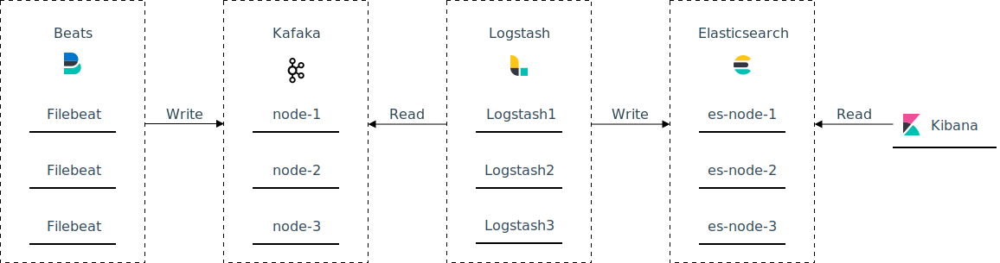

# Elastic Stack + Kafka 分布式环境搭建

## Elastic Stack + Kafka 工作流

```text
Filebeat --> Kafka --> Logstash --> Elasticsearch --> Kibana
```



Filebeat 读取日志到 Kafka，Logstash 从 Kafka 队列中读取日志信息，对日志信息做分析和切割，并写入到 Elasticsearch 集群， Kibana 读取 Elasticsearch 中的日志信息做可视化展示。

## 部署准备

### 系统信息

```bash
rpm -q centos-release
centos-release-7-5.1804.el7.centos.2.x86_64
```

### 软件信息

| 软件 | 版本 |
| :--- | :--- |
| JDK | 1.8 |
| Filebeat | 7.3.1 |
| Logstash | 7.3.1 |
| Elasticsearch | 7.3.1 |
| Kibana | 7.3.1 |
| kafka | 2.1.0 |

### 服务器信息

| 机器名称 | IP | 安装软件 |
| :--- | :--- | :--- |
| node-1 | 172.17.0.4 | Filebeat + Kafka + Logstash + Elasticsearch + Kibana |
| node-2 | 172.17.0.30 | Filebeat + Kafka + Logstash + Elasticsearch  |
| node-3 | 172.17.0.103 | Filebeat + Kafka + Logstash + Elasticsearch  |

## Elasticsearch 集群部署

### 安装

```bash
curl -L -O https://artifacts.elastic.co/downloads/elasticsearch/elasticsearch-7.3.1-x86_64.rpm
sudo rpm -i elasticsearch-7.3.1-x86_64.rpm
```

### 配置

```bash
vim /etc/elasticsearch/elasticsearch.yml
```

**node-1**

```text
cluster.name: es-cluster
node.name: es-node-1
node.master: true
node.data: true
path.data: /var/lib/elasticsearch
path.logs: /var/log/elasticsearch
network.host: 172.17.0.4
discovery.seed_hosts: ["172.17.0.4:9300", "172.17.0.30:9300", "172.17.0.30:9300"] 
cluster.initial_master_nodes: ["es-node-1", "es-node-2", "es-node-3"]
gateway.recover_after_nodes: 1
http.cors.enabled: true
http.cors.allow-origin: "*"
```

**node-2**

```text
cluster.name: es-cluster
node.name: es-node-2
node.master: true
node.data: true
path.data: /var/lib/elasticsearch
path.logs: /var/log/elasticsearch
network.host: 172.17.0.30
discovery.seed_hosts: ["172.17.0.4:9300", "172.17.0.30:9300", "172.17.0.30:9300"] 
cluster.initial_master_nodes: ["es-node-1", "es-node-2", "es-node-3"]
gateway.recover_after_nodes: 1
http.cors.enabled: true
http.cors.allow-origin: "*"
```

**node-3**

```text
cluster.name: es-cluster
node.name: es-node-1
node.master: true
node.data: true
path.data: /var/lib/elasticsearch
path.logs: /var/log/elasticsearch
network.host: 172.17.0.103
discovery.seed_hosts: ["172.17.0.4:9300", "172.17.0.30:9300", "172.17.0.30:9300"] 
cluster.initial_master_nodes: ["es-node-1", "es-node-2", "es-node-3"]
gateway.recover_after_nodes: 1
http.cors.enabled: true
http.cors.allow-origin: "*"
```

### 启动

```bash
service elasticsearch start
```

查看集群是否启动成功

```bash
curl http://172.17.0.4:9200
```

如果出现类似下面的信息说明集群启动成功

```text
{
  "name" : "es-node-1",
  "cluster_name" : "es-cluster",
  "cluster_uuid" : "Vj5OJkf5SxKsfHmjeAYScw",
  "version" : {
    "number" : "7.3.1",
    "build_flavor" : "default",
    "build_type" : "rpm",
    "build_hash" : "4749ba6",
    "build_date" : "2019-08-19T20:19:25.651794Z",
    "build_snapshot" : false,
    "lucene_version" : "8.1.0",
    "minimum_wire_compatibility_version" : "6.8.0",
    "minimum_index_compatibility_version" : "6.0.0-beta1"
  },
  "tagline" : "You Know, for Search"
}
```

## Kibana 部署

Kibana 部署在 node-1 机器

### 安装

```bash
curl -L -O https://artifacts.elastic.co/downloads/kibana/kibana-7.3.1-linux-x86_64.tar.gz
tar xzvf kibana-7.3.1-linux-x86_64.tar.gz
```

### 配置

```bash
vim /opt/devops/kibana-7.3.1-linux-x86_64/config/kibana.yml
```

```text
server.host: "0.0.0.0"
elasticsearch.hosts: ["http://172.17.0.4:9200", "http://172.17.0.30:9200", "http://172.17.0.30:9200"]
i18n.locale: "zh-CN"
```

### 启动

```bash
/opt/devops/kibana-7.3.1-linux-x86_64/bin/kibana -d
```

访问 [http://172.17.0.4:5601](http://127.0.0.1:5601) 验证kibana是否启动成功

## Filebeat 部署

### 安装

```bash
curl -L -O https://artifacts.elastic.co/downloads/beats/filebeat/filebeat-7.3.1-x86_64.rpm
sudo rpm -vi filebeat-7.3.1-x86_64.rpm
```

### 配置

```bash
vim /etc/filebeat/filebeat.yml
```

这里我们以一个 Spring Boot 项目的日志为例，日志存放的目录为 /path/to/your/log/spring-boot-action.log 

```text
- type: log
  paths:
    - /path/to/your/log/spring-boot-action.log
  multiline:  
    pattern: ^\[
    negate: true                      
    match: after                           
    max_lines: 1000     
    timeout: 30s
    tags: ["spring-boot"]
setup.kibana:
  host: "http://172.17.0.4:5601"
output.elasticsearch:
  hosts: ["172.17.0.4:9200","172.17.0.30:9200","172.17.0.103:9200"]  
```

### 启动

```bash
sudo filebeat setup # 加载 Kibana 仪表板
sudo service filebeat start
```

> 这里需要注意的是 `setup.kibana` 和 `output.elasticsearch` 两项都需要正确配置 `setup` 命令才会成功

到这里一个最简单的 Elastic Stack 环境就配置好了，首先访问我们的 Spring Boot 服务，产生一些日志，然后访问 [http://172.17.0.4:5601/app/kibana\#/discover](http://172.17.0.4:5601/app/kibana#/discover) ，在 Kibana 的控制台能看到 Spring Boot 服务产生的日志信息。

## Logstash 部署

前面我们已经部署好了一个简单的 Elastic Stack 环境，Spring Boot 的日志也能成功的在 Kibana 中展示，但是每条日志都是做为一个整体放在 message 字段中，显然在我们的实际应用场景中这样的信息是不合适的，我们需要引入 Logstash 对日志进行切割，通过 Logstash 我们可以将日志中的时间，日志级别，类名，日志内容等信息拆分到单独的字段中，方便我们在更细的维度查看日志。

下面介绍 Logstash 的安装，以及怎么把 Logstash 加入到上面的 Elastic Stack 环境中。

### 安装

```bash
curl -L -O https://artifacts.elastic.co/downloads/logstash/logstash-7.3.1.rpm
sudo rpm -i logstash-7.3.1.rpm
```

### 配置

**配置 Logstash 工作流**

```bash
vim /etc/logstash/conf.d/logstash.conf 
input {
  beats {
    port => 5044
  }
}

filter {
  grok {
    match => {
       "message" => "\s*\[%{TIMESTAMP_ISO8601:time}\]\s* \s*%{LOGLEVEL:level}\s* \s*(?<prefix>\w+)\s* \s*%{JAVACLASS:class}\((?<function>[A-Za-z0-9_. -:]+)\)\s* \s*%{JAVALOGMESSAGE:logmessage}\s*"
    }
  }
}

output {
  elasticsearch {
    hosts => ["http://172.17.0.4:9200", "http://172.17.0.30:9200", "http://172.17.0.103:9200"]
   index => "%{[@metadata][beat]}-%{[@metadata][version]}-%{+YYYY.MM.dd}"
  }
}
```

这里用到了 Logstash 中的 grok 过滤器，[官方文档](https://www.elastic.co/guide/en/logstash/current/plugins-filters-grok.html)中有详细的介绍，这里不做展开，由于 grok 配置调试起来比较麻烦，建议先在 [Grok Debugger](https://grokdebug.herokuapp.com/) 工具中调试好 grok 的日志解析配置。

```text
[2019-09-01 18:40:16,909] ERROR summer io.summer.springboot.exception.handler.CommonExceptionHandler.exceptionHandler(CommonExceptionHandler.java:39) - Exception: AppTraceEntity(localPort=18003, localAddress=112.20.80.146, remoteAddress=112.20.80.146, method=GET, uri=/demo/500, headers={accept-language=zh-CN,zh;q=0.9,en;q=0.8,la;q=0.7,fr;q=0.6, accept=text/html,application/xhtml+xml,application/xml;q=0.9,image/webp,image/apng,*/*;q=0.8,application/signed-exchange;v=b3, host=115.159.195.167:18003, upgrade-insecure-requests=1, connection=keep-alive, cache-control=max-age=0, accept-encoding=gzip, deflate, user-agent=Mozilla/5.0 (Macintosh; Intel Mac OS X 10_14_6) AppleWebKit/537.36 (KHTML, like Gecko) Chrome/76.0.3809.132 Safari/537.36}, params=org.apache.catalina.util.ParameterMap@3e6554b0)
java.lang.ArithmeticException: / by zero
```

上面的日志样本对应的 Grok 配置如下

```text
\s*\[%{TIMESTAMP_ISO8601:time}\]\s* \s*%{LOGLEVEL:level}\s* \s*(?<prefix>\w+)\s* \s*%{JAVACLASS:class}\((?<function>[A-Za-z0-9_. -:]+)\)\s* \s*%{JAVALOGMESSAGE:logmessage}\s*
```

**修改 Filebeat 配置**

```bash
vim /etc/filebeat/filebeat.yml
- type: log
  paths:
    - /path/to/your/log/spring-boot-action.log
  multiline:  
    pattern: ^\[
    negate: true                      
    match: after                           
    max_lines: 1000     
    timeout: 30s
    tags: ["spring-boot"]
setup.kibana:
  host: "http://172.17.0.4:5601"
output.logstash:
  hosts: ["172.17.0.4:5044"]
```

### 启动

```bash
sudo service logstash start
sudo service filebeat restart
```

这时我们在产生一些新的 Spring Boot 服务日志再到 Kibana 控制台查看会发现新的日志已经按照日志级别，包名等拆分到不同的字段了。

## Kafka 集群部署

在生成中常常会遇到一些突发的超负荷请求，这样突发的大量请求可能会导致 Logstash 超负荷工作而导致奔溃，为了应对这种场景，需要在 Filebeat 和 Logstash 中间加入一个消息队里作为缓冲，下面以 Kafka 为例介绍怎么把 Kafka 接入到 Elastic Stack 环境中。

安装目录指定为 /opt/devops

### 安装

```bash
cd /opt/devops
curl -L -O https://archive.apache.org/dist/kafka/2.1.0/kafka_2.11-2.1.0.tgz
tar -zxf kafka_2.11-2.1.0.tgz
cd kafka_2.11-2.1.0
```

> 这里需要注意 kafka 的版本， Logstash 中 [Kafka Input 插件](https://www.elastic.co/guide/en/logstash/current/plugins-inputs-kafka.html)中使用的 Kafka Client 版本为 2.1.0 ，kafka 服务的版本需要与 Kafka Client 版本[兼容](https://cwiki.apache.org/confluence/display/KAFKA/Compatibility+Matrix)，为了省去版本兼容的麻烦最省事的办法就是让 Kafka 服务的版本和 Kafka Client 版本保持一致，所以这里 Kafka 服务版本为 2.1.0

### 配置 Zookeeper

```bash
vim /opt/devops/kafka_2.11-2.1.0/config/zookeepr.properties
```

三台机器配置都一样

```text
dataDir=/opt/zookeeper-data
clientPort=2181
server.1=172.17.0.4:2888:3888
server.2=172.17.0.30:2888:3888
server.3=172.17.0.103:2888:3888
```

### 配置 Kafka 集群

```text
vim /opt/devops/kafka_2.11-2.1.0/config/server.properties
```

node-1

```text
broker.id=1
port=9092
host.name=172.17.0.4
log.dirs=/opt/kafka-logs
zookeeper.connect=172.17.0.4:2181,172.17.0.30:2181,172.17.0.103:2181
```

node-2

```text
broker.id=2
port=9092
host.name=172.17.0.30
log.dirs=/opt/kafka-logs
zookeeper.connect=172.17.0.4:2181,172.17.0.30:2181,172.17.0.103:2181
```

node-3

```text
broker.id=3
port=9092
host.name=172.17.0.103
log.dirs=/opt/kafka-logs
zookeeper.connect=172.17.0.4:2181,172.17.0.30:2181,172.17.0.103:2181
```

### 启动 Zookeeper

```bash
/opt/devops/kafka_2.11-2.1.0/bin/kafka-topics.sh --list --zookeeper 172.17.0.4:2181bin/zookeeper-server-start.sh -daemon config/zookeeper.properties
```

### 启动 Kafka

```bash
/opt/devops/kafka_2.11-2.1.0/bin/kafka-server-start.sh -daemon config/server.properties
```

### 验证服务健康

**创建 Topic**

```bash
/opt/devops/kafka_2.11-2.1.0/bin/kafka-topics.sh --create --zookeeper 172.17.0.4:2181 --replication-factor 1 --partitions 1 --topic test
```

**查询 Topic**

```bash
/opt/devops/kafka_2.11-2.1.0/bin/kafka-topics.sh --list --zookeeper 172.17.0.4:2181
```

### 修改配置

Kafka 集群部署好后，Filebeat 和 Logstash 相应的配置也要做出修改

修改 Filebeat 配置

```text
vim /etc/filebeat/filebeat.yml
- type: log
  paths:
    - /path/to/your/log/spring-boot-action.log
  multiline:  
    pattern: ^\[
    negate: true                      
    match: after                           
    max_lines: 1000     
    timeout: 30s
    tags: ["spring-boot"]
setup.kibana:
  host: "http://172.17.0.4:5601"
output.kafka:
  hosts: ["172.17.0.4:9092","172.17.0.30:9092","172.17.0.103:9092"]
  topic: "filebeat"
```

修改 Logstash 配置

```text
vim /etc/logstash/conf.d/logstash.conf 
input {
      kafka {
       bootstrap_servers => "172.17.0.4:9092,172.17.0.30:9092,172.17.0.104:9092"
       topics => ["filebeat"]
       codec => "json"
    }
 }

filter {
  grok {
    match => {
       "message" => "\s*\[%{TIMESTAMP_ISO8601:time}\]\s* \s*%{LOGLEVEL:level}\s* \s*(?<prefix>\w+)\s* \s*%{JAVACLASS:class}\((?<function>[A-Za-z0-9_. -:]+)\)\s* \s*%{JAVALOGMESSAGE:logmessage}\s*"
    }
  }
}

output {
  elasticsearch {
    hosts => ["http://172.17.0.4:9200", "http://172.17.0.30:9200", "http://172.17.0.103:9200"]
   index => "%{[@metadata][beat]}-%{[@metadata][version]}-%{+YYYY.MM.dd}"
  }
}
```

### 重启服务

```bash
service filebeat restart
service logstash restart
```


