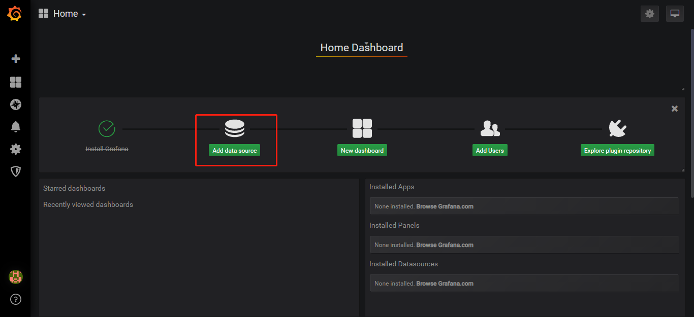
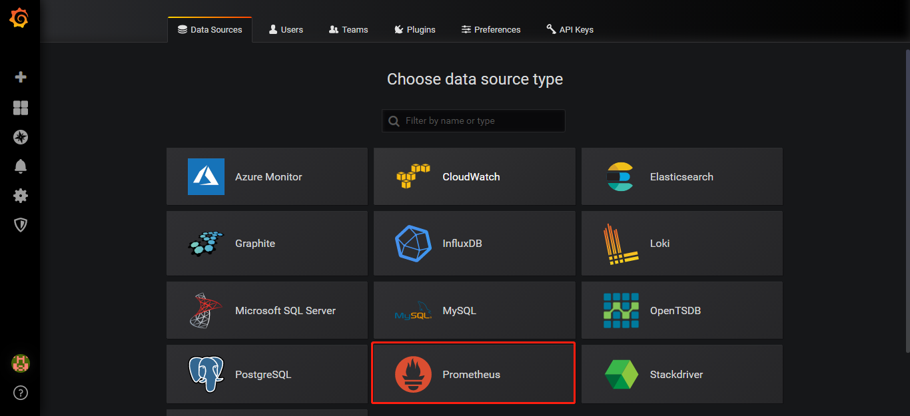
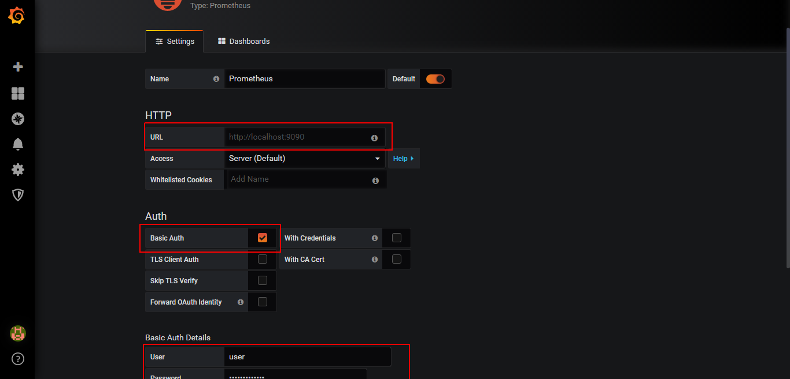
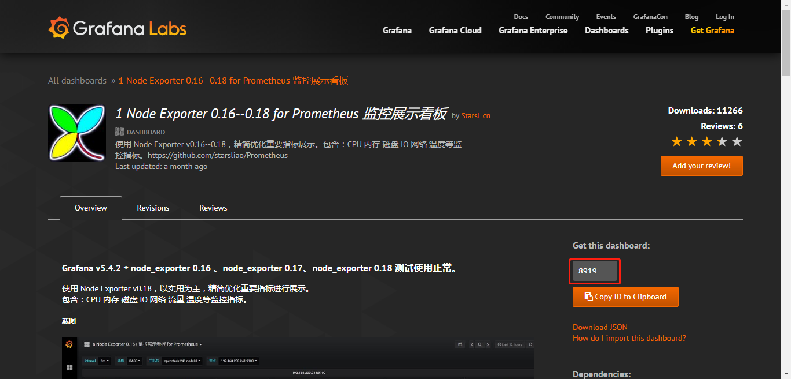
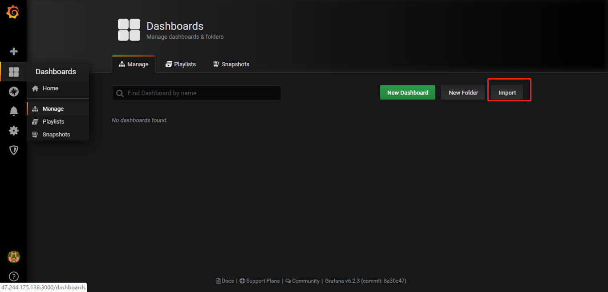
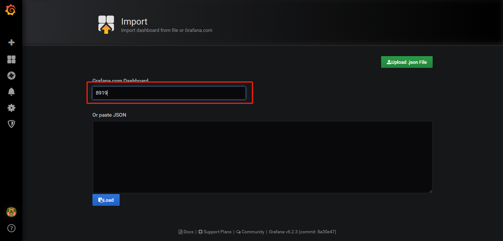
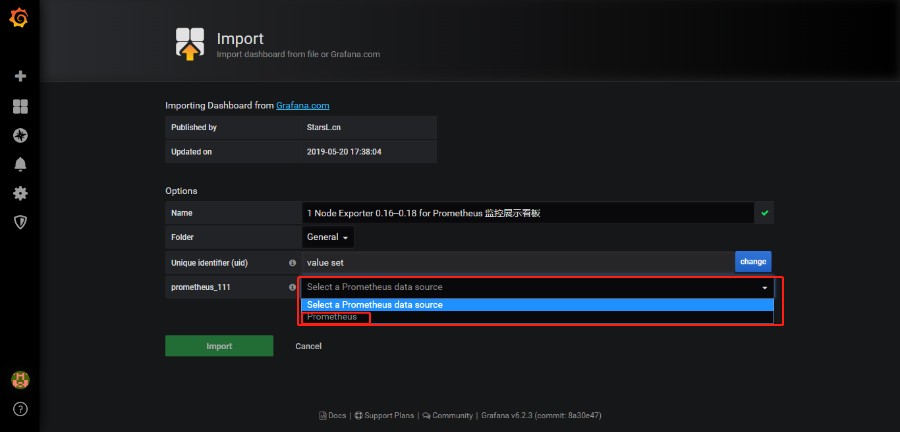
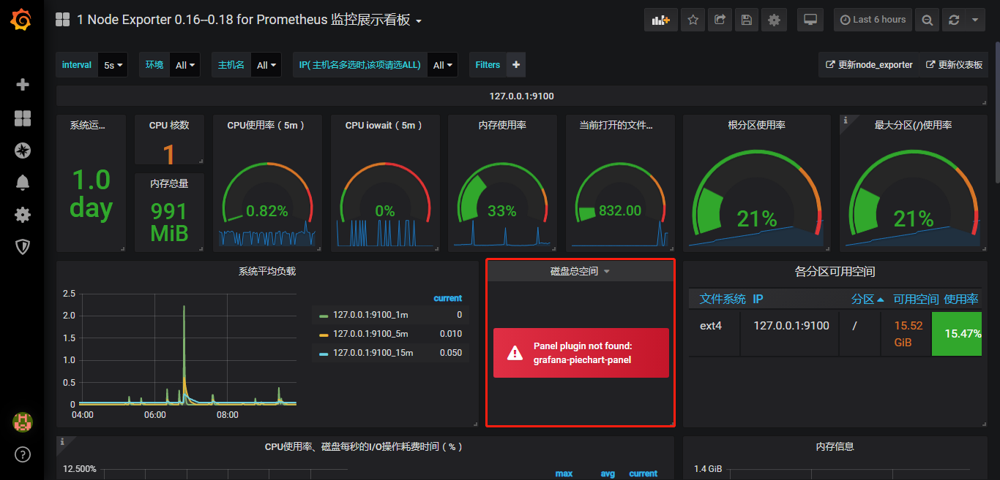

# 配置

截止到 2019年6月18日，Grafana 已经发布了 [v6.2.3](https://github.com/grafana/grafana/releases/tag/v6.2.3) 版本，而官方的教程示例还停留在 5.x 版本，6.x 版本与 5.x 版本界面上有了很大的改版，下面我们基于 v6.2.1 版本讲解一些 Grafana 中常用的配置，没一种类型的面板都会用一个具体的场景演示各个面板的用法。

这里我们会用到 Prometheus 做为数据源，用 Prometheus 官方提供的 node\_exporter 作为 metrics 采集源， Prometheus 和 node\_exporter 的安装和配置可以参考前文。

## 初始化密码


Grafana 的默认登陆账号密码都是 admin，第一次登陆时会跳转到密码重置页面，我们可以重置默认密码（推荐），当然也可以跳过。

## 添加数据源



登陆成功后在首页点击 Add data source 开始添加数据源



这里选择 Prometheus



**URL**： 填写 promethues 服务的完整地址，我们这里填 http://localhost:9090

**Auth**：出于安全考虑我们可能要对数据源进行权限验证，这里支持 Basic Auth 和 TLS，我们这里只做演示不做勾选。

**Scrape interval**： 抓取数据源的时间间隔，默认 15 秒，这里我们也使用默认值

## 使用模板

Grafana 社区提供了很多用户制作的第三方[模板](https://grafana.com/dashboards)，下面介绍怎么使用这些模板。



首先在模板库中选好我们需要的模板，拷贝模板ID



点击 import 



粘贴刚刚拷贝的模板ID点击 load



选择好前面配置的数据源，到此模板导入完成。



上图我们看到模板中有一个面板显示不正常，这是因为 Grafana 默认安装包中没有提供 grafana-piechart-panel 插件，需要我们手动安装。

## 安装插件

Grafana 官方提供了两种方式安装插件，方便我们应对各种安装场景。

### 命令行安装

```bash
grafana-cli plugins install grafana-piechart-panel
```

这种方式最简单，但是需要服务器连接外网，如果我们的服务器没有外网的访问权限就只能使用手动安装的方式来安装。

### 手动安装

开始介绍手动安装之前有两个配置需要说明一下，Grafana 的环境变量配置放在 /etc/sysconfig/grafana-server 文件中，如下：



```text
GRAFANA_USER=grafana
GRAFANA_GROUP=grafana
GRAFANA_HOME=/usr/share/grafana
LOG_DIR=/var/log/grafana
DATA_DIR=/var/lib/grafana
MAX_OPEN_FILES=10000
CONF_DIR=/etc/grafana
CONF_FILE=/etc/grafana/grafana.ini
RESTART_ON_UPGRADE=true
PLUGINS_DIR=/var/lib/grafana/plugins
PROVISIONING_CFG_DIR=/etc/grafana/provisioning
# Only used on systemd systems
PID_FILE_DIR=/var/run/grafana
```



Grafana 的**配置文件**由 CONF\_FILE 指定，默认为  /etc/grafana/grafana.ini ，**插件安装目录**由 PLUGINS\_DIR 配置，默认 /var/lib/grafana/plugins，这两个路径后面需要用到。

首先外网环境下载插件包

```bash
git clone https://github.com/grafana/piechart-panel.git
```

然后上传插件包到内网服务器 Grafana 的**插件安装目录**下，或者我们也可以上传到自定义的目录（假设目录为： /path/to/clone/dir/piechart-panel），然后在 grafana.ini **配置文件**中添加如下代码

```text
[plugin.piechart]
path = /path/to/clone/dir/piechart-panel
```

需要注意的是，不管是手动安装还是命令行安装，安装完成后都需要重启 grafana-server 服务

```text
systemctl restart grafana-server
```

重启完成后刷新页面，模板展示正常我，其他插件也是通过这样的方式安装。

