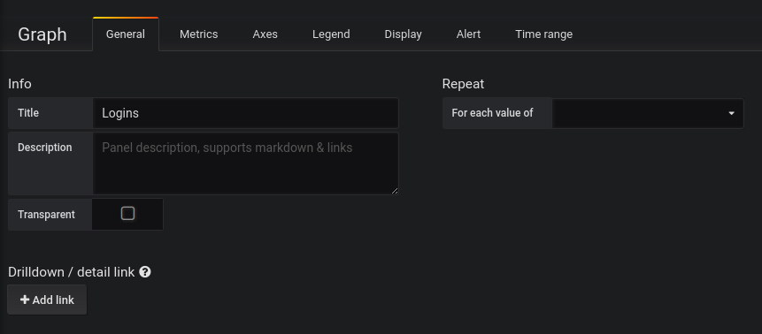

# 图表：Graph

图表（Graph）是 Grafana 中最常用到的面板，我们可以通过它的丰富的配置选项灵活的自定义自己的图表。

## 常规配置

### Info

* **Title** - The panel title of the dashboard, displayed at the top.
* **Description** - The panel description, displayed on hover of info icon in the upper left corner of the panel.
* **Transparent** - If checked, removes the solid background of the panel \(default not checked\).

